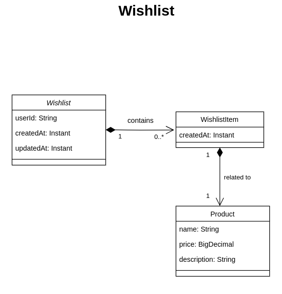

# JayaTech Wishlist API

A avaliação consiste na criação de uma API para o gerenciamento de uma lista de desejos de um usuário. Nesta API, o usuário poderá realizar uma busca de todos os produtos, como também criar uma nova lista de desejos, inserindo novos produtos a esta lista e também removendo. O usuário pode buscar por sua lista de desejos, com os produtos ordenados pela ordem de inserção, como também pode checar se o produto está presente na lista de desejos.

## Comentários
A API foi criada utilizando Spring boot 3 e como banco de dados, foi utilizado o MongoDB. Foram feitas validações personalizadas de exceções, de acordo com todas as regras de negócio.
Coleções do Postman também foram inseridas e podem ser acessadas na pasta collections, onde foram inseridas as possíveis respostas para cada requisição que é disponível na aplicação.
A API foi documentada utilizando a especificação OpenAPI e pode ser acessada pelos seguintes endereços após a execução da aplicação:

Visualização por interface
* http://localhost:8080/swagger-ui/index.html#/

Visualização da documentação da aplicação em formato Json padronizado pela especificação OpenAPI:
* http://localhost:8080/api-docs

## Instruções para executar a aplicação
Para executar a aplicação, o usuário deve ter instalado no computador <b>Maven</b>, <b>Docker</b> e <b>Docker compose</b>.
Depois de clonar este repositório, o usuário deve executar no terminal o seguinte comando:
``` 
sh server.sh 
``` 
Os comandos utilizados neste arquivo para criar as imagens necessárias para a execução da aplicação foram:
``` 
sudo docker pull openjdk:17-jdk-slim 
sudo docker pull mongo:latest 
mvn clean package 
sudo docker compose build 
sudo docker compose up -d 
``` 
Caso seja necessário, o usuário deve inserir a senha de administrador da máquina onde a aplicação será executada.
Em seguida o usuário deve aguardar a criação das imagens necessárias para a execução da aplicação. Quando for finalizada, poderá acessar os endpoints da API utilizando o endereço http://localhost:8080/.

## Considerações
* O aplicativo backend foi encapsulado e pode ser executado usando docker compose.
* Existem validações e respostas personalizadas para cada exceção gerada, como também logs de erros.
* Foram semeados alguns produtos e uma lista de desejos adicionadas no banco de dados que podem servir como testes posteriormente. O ID da lista de desejos é ``wishlistId1``.
* Foi utilizado a ferramenta de migração <b>Mongock</b> do banco de dados <b>MongoDB </b>para gerenciar as migrações.
* Foi adicionado cobertura de testes durante o desenvolvimento, utilizando boas práticas de testes unitários utilizando <b>Mockito</b>, de integração utilizando <b>test containers</b>, como também testes automatizados para avaliar comportamento da aplicação utilizando <b>Cucumber</b>.
* Foi inserido documentação do código da classe de serviços para mais clareza da lógica e do tratamento de cada comportamento.
* Durante todo o desenvolvimento do teste, sempre foram empregues boas práticas de engenharia de software e arquitetura da aplicação.

## Diagrama de classes de modelo da aplicação
 